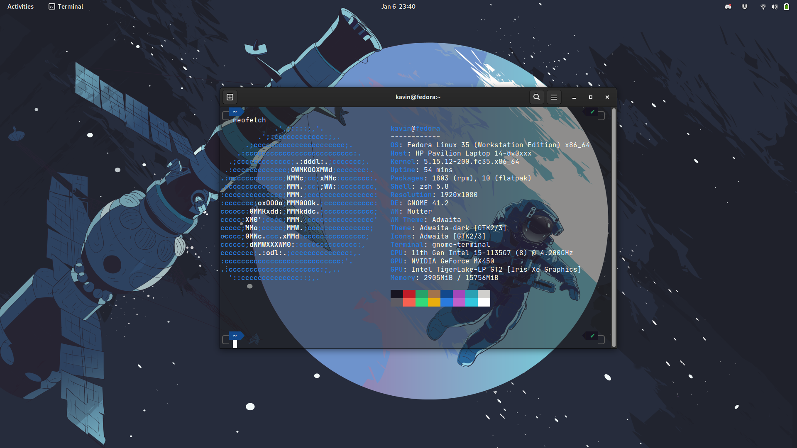
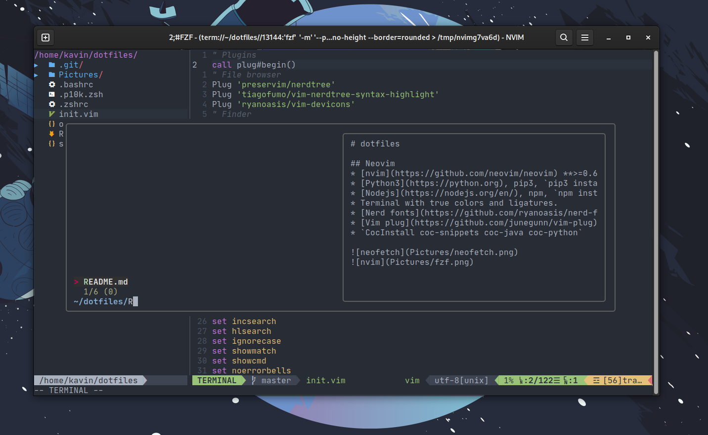

# dotfiles

## Neovim
* [nvim](https://github.com/neovim/neovim) **>=0.6**
* [Python3](https://python.org), pip3, `pip3 install pynvim`
* [Nodejs](https://nodejs.org/en/), npm, `npm install -g neovim`
* Terminal with true colors and ligatures. 
* [Nerd fonts](https://github.com/ryanoasis/nerd-fonts)
* [Vim plug](https://github.com/junegunn/vim-plug)
* `CocInstall coc-snippets coc-java coc-python`

