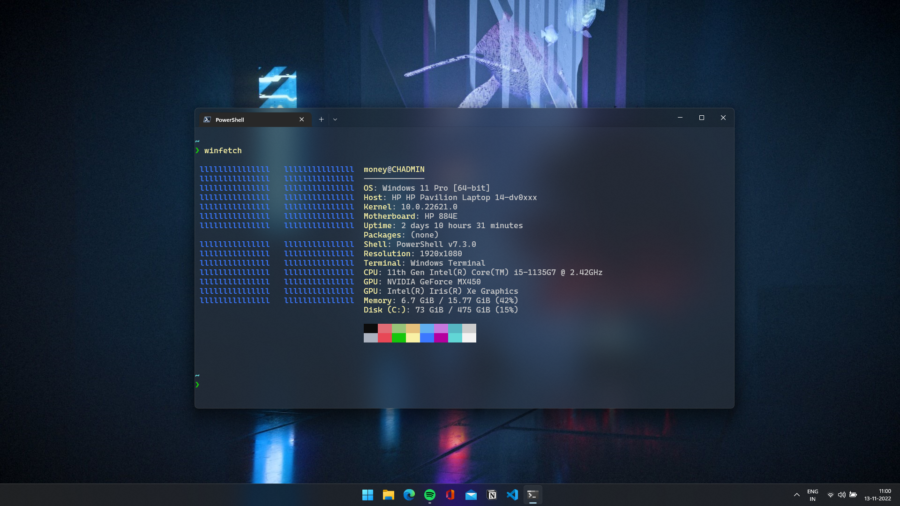

# dotfiles

## specs
* Intel i5-1135G7 28W
* Samsung 16G DDR4-3200Mhz
* SK Hynix 512GB NVME 3.0
* Intel Iris Xe + Nvidia MX450

## os and setup
* Windows 11 Pro
* [*Windows Terminal*](https://github.com/microsoft/terminal) + [*PowerShell Core*](https://github.com/PowerShell/PowerShell) + [*Starship*](https://github.com/starship/starship)

## ides and text editors
### neovim
* [nvim](https://github.com/neovim/neovim) 
* [python3](https://python.org), pip3, `pip3 install pynvim`
* [nodejs](https://nodejs.org), npm, `npm install -g neovim`
* Terminal with true color and ligatures support
* [nerdfonts](https://github.com/ryanoasis/nerd-fonts)
* [vim-plug](https://github.com/junegunn/vim-plug)
* [`CocInstall coc-snippets coc-java coc-python coc-rls coc-tsserver`](https://github.com/neoclide/coc.nvim/wiki/Using-coc-extensions#implemented-coc-extensions)

### vscode and intellij
* [github copilot](https://github.com/features/copilot)
* [onedark](https://plugins.jetbrains.com/plugin/11938-one-dark-theme)

## screenshots

