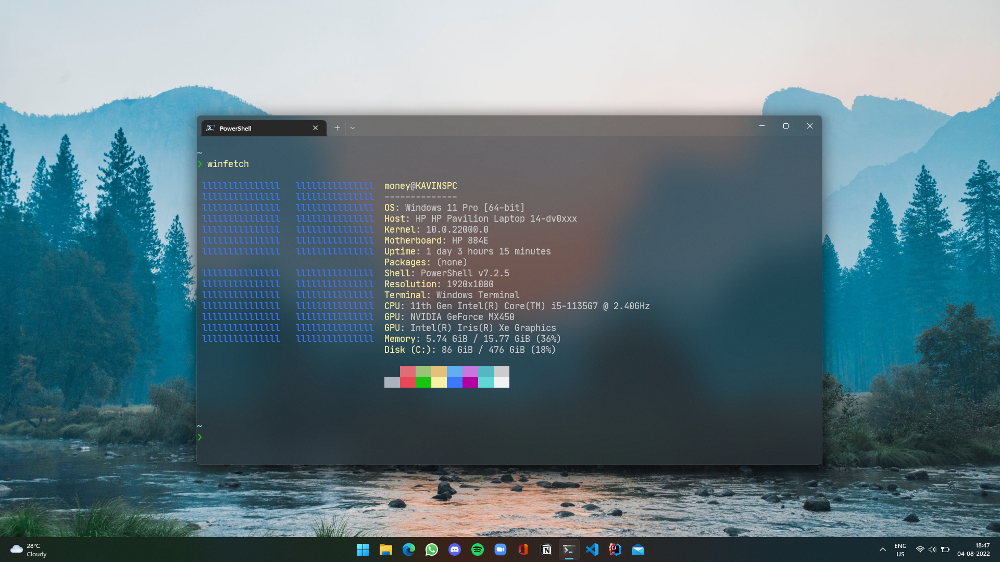

# dotfiles

## specs
* i5-1135G7 28W
* 16G DDR4-3200
* 512GB NVME
* Iris Xe + Nvidia MX450

## os and setup
* Windows 11 Pro
* [Windows Terminal](https://github.com/microsoft/terminal) + [PowerShell Core](https://github.com/PowerShell/PowerShell) + [Starship](https://github.com/starship/starship)
* Fedora 36
* [gnome-terminal](https://gitlab.gnome.org/GNOME/gnome-terminal) + [zsh](https://ohmyz.sh/) + [p10k](https://github.com/romkatv/powerlevel10k)

## neovim
* [nvim](https://github.com/neovim/neovim) 
* [python3](https://python.org), pip3, `pip3 install pynvim`
* [nodejs](https://nodejs.org), npm, `npm install -g neovim`
* Terminal with true color and ligature support
* [nerdfonts](https://github.com/ryanoasis/nerd-fonts)
* [vim-plug](https://github.com/junegunn/vim-plug)
* [`CocInstall coc-snippets coc-java coc-python coc-rls coc-tsserver`](https://github.com/neoclide/coc.nvim/wiki/Using-coc-extensions#implemented-coc-extensions)

## screenshots

