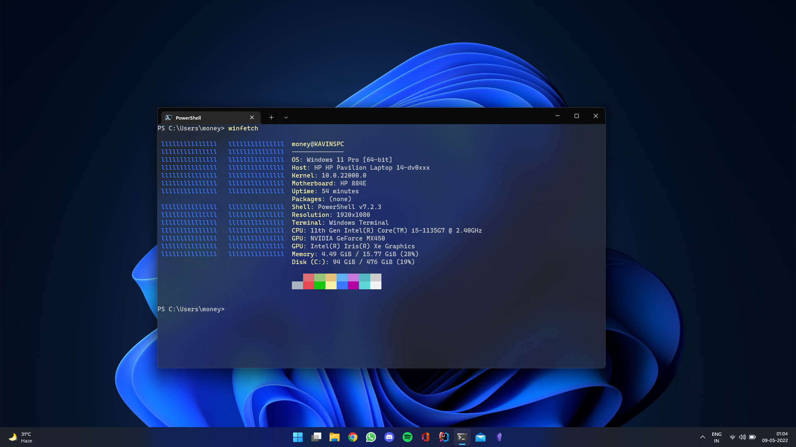

# dotfiles
## specs
* Intel i5-1135G7 28W, 16G DDR4 3200, 512GB NVME, Iris Xe + Nvidia MX450
* Windows 11 + Fedora 35
* Windows Terminal, Powershell Core / Kitty, ZSH + p10k

## neovim
* [nvim](https://github.com/neovim/neovim) **>=0.7**
* [python3](https://python.org), pip3, `pip3 install pynvim`
* [nodejs](https://nodejs.org), npm, `npm install -g neovim`
* Terminal with true colors and ligature support
* [nerdfonts](https://github.com/ryanoasis/nerd-fonts)
* [vim-plug](https://github.com/junegunn/vim-plug)
* [`CocInstall coc-snippets coc-java coc-python`](https://github.com/neoclide/coc.nvim/wiki/Using-coc-extensions#implemented-coc-extensions)

